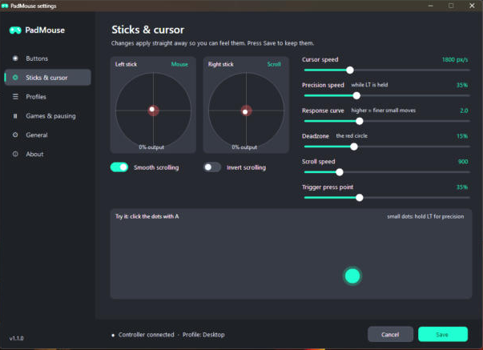
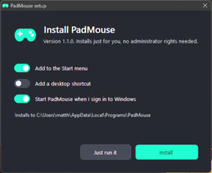

# PadMouse

**Use your game controller (Xbox, PlayStation, Switch and more) as a mouse and keyboard on Windows.** PadMouse runs quietly in the system tray, so you can browse, watch videos and control your PC from the sofa. It steps aside automatically when you launch a game.

## Features

- **Works with most controllers:** Xbox, PlayStation (DualShock 4 / DualSense), Nintendo Switch Pro and most other USB or Bluetooth pads. A quick set-up wizard handles controllers it doesn't recognise, and button names in Settings match your controller.
- **Mouse control:** the left stick moves the cursor, the right stick scrolls, A clicks and B right-clicks. Hold LT for a slow, precise cursor.
- **On-screen keyboard:** press Y to type with the D-pad. The keyboard never steals focus, so text goes into the window you were using.
- **Remap anything:** click a button on the controller picture, or press it on the controller itself, then pick a mouse action or any key combination.
- **Profiles:** separate button layouts for the desktop, browsers and media players. PadMouse switches between them automatically depending on the app in front, or you can hold View and press RB or LB to switch.
- **Pauses for games:** when a fullscreen game is in front, PadMouse gets out of the way and resumes when you leave the game.
- **Feedback:**
  - on-screen pop-ups and rumble when you switch PadMouse on or off or change profile
  - a low-battery warning
  - a tray icon that shows the current state: green when on, amber when paused, grey when off
- **Live tuning:** see the stick deadzone, try cursor speeds on a target practice area, and adjust everything with sliders.
- **Installs and updates itself:** one exe, with no admin rights needed. It adds a Start menu entry and appears in Settings → Apps. Updates install in-app.
- **Optional admin mode:** lets PadMouse control admin windows such as Task Manager.

## Install

1. Download **PadMouse.exe** from the [latest release](../../releases/latest).

   

2. Run it and choose **Install**. Choose **Just run it** if you'd rather not install it.
3. A welcome guide shows what every button does.

Windows may say "Windows protected your PC" because PadMouse isn't code-signed yet. Click **More info → Run anyway**. See [docs/SIGNING.md](docs/SIGNING.md) for why.

PadMouse needs 64-bit Windows 10 or 11, which already include .NET Framework 4.8, and a game controller, wired or wireless.

## Controllers

| Controller | How to connect |
|---|---|
| Xbox (One, Series, 360) | USB, Bluetooth or the Xbox wireless adapter |
| PlayStation 4 / 5 (DualShock 4, DualSense) | USB cable, or pair in Windows Bluetooth settings |
| Nintendo Switch Pro / Joy-Cons | Pair in Windows Bluetooth settings, or USB |
| Other controllers | Plug in. If PadMouse says "needs set-up", run the set-up wizard from Settings → Controllers |

With several controllers connected, PadMouse follows whichever one you pressed a button on last. The first press on a newly picked-up controller only switches to it.

On PlayStation controllers, ✕ = A, ○ = B, □ = X, △ = Y, L1/R1 = LB/RB, L2/R2 = LT/RT, Share = View and Options = Menu.

## Default controls

| Control | Desktop profile |
|---|---|
| Left stick | Move the mouse |
| Right stick | Scroll |
| A / RT | Left click (hold to drag) |
| B | Right click |
| X | Middle click |
| Y | On-screen keyboard |
| LT (hold) | Precision (slow cursor) |
| LB / RB | Back / Forward |
| D-pad | Arrow keys |
| View | Escape |
| Menu | Windows key |
| L3 | Task View |
| **View + Menu** | **Switch PadMouse on or off** |
| **View + RB / LB** | **Next / previous profile** |

The **Browser** profile turns LB and RB into tab switching and the D-pad into Page Up/Down. The **Media** profile turns A into play/pause and the D-pad into volume and track controls.

## Settings

Click the tray icon, or run PadMouse again while it's already running. Settings are stored in `%APPDATA%\PadMouse\config.ini` and can also be edited by hand.

## Troubleshooting

- **The tray icon isn't visible.** Windows 11 hides new icons behind the `^` arrow. Go to Settings → Personalisation → Taskbar → Other system tray icons and turn on PadMouse.
- **The cursor moves twice as fast.** Steam's "Desktop Layout" is also controlling the mouse. Turn off Steam Input for Xbox controllers, or close Steam.
- **PadMouse doesn't work in admin windows.** Turn on "Start as administrator" in Settings → General, or use Restart as administrator.
- **A fullscreen video pauses PadMouse.** Add the player to the "Never pause" list in Settings → Games & pausing.
- **Something else goes wrong.** Errors are logged in `%APPDATA%\PadMouse\error.log`.

## Building

Run `build.bat`. It uses the C# compiler that ships with Windows, so you don't need Visual Studio. The output is `dist\PadMouse.exe`. Visual Studio users can open `PadMouse.csproj` instead.

Each push to `main` is built by GitHub Actions. Pushing a tag such as `v1.2.0` publishes a release that the in-app updater picks up. See [docs/RELEASING.md](docs/RELEASING.md).

## Licence

MIT. Includes SDL 2 (zlib licence); see [docs/THIRD-PARTY.md](docs/THIRD-PARTY.md). Xbox is a trademark of Microsoft. PadMouse isn't affiliated with or endorsed by Microsoft.
